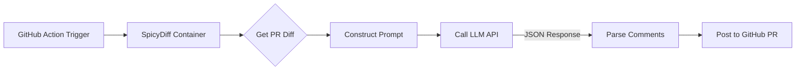

# Product Requirement Document: SpicyDiff (🌶️ 辛辣差分)

| 版本 | 日期 | 作者 | 状态 | 备注 |
| --- | --- | --- | --- | --- |
| v1.0 | 2024-05-20 | AI Team | Draft | 初始 MVP 定义 |

## 1. 项目概述 (Project Overview)

**SpicyDiff** 是一个基于大语言模型（LLM）的自动化代码审查工具，以 GitHub Action 的形式集成在 CI/CD 流程中。

与传统的静态代码分析工具（如 SonarQube）不同，SpicyDiff 不仅关注代码逻辑，更侧重于**人格化的交互体验**。它能够根据配置，扮演“毒舌主厨”或“夸夸群群主”两种极端角色，对代码变更（Diff）进行评论，旨在为枯燥的代码审查过程增加趣味性与传播性，同时指出代码中的“坏味道”或亮点。

### 1.1 核心价值

* **情绪价值**：通过幽默或赞美的方式缓解 Code Review 的紧张感。
* **代码质量**：利用 LLM 识别潜在的逻辑漏洞、命名不规范和反模式。
* **自动化**：无缝集成 GitHub Pull Request 流程，无需人工干预。

---

## 2. 用户角色 (User Personas)

* **Repository Maintainer (仓库维护者)**：希望在团队中引入有趣的工具，活跃开发气氛，同时进行基础的代码质量把关。
* **Developer (开发者)**：提交 PR 后，希望得到快速反馈（即使是被嘲讽），享受与 AI 互动的乐趣。

---

## 3. 功能需求 (Functional Requirements)

### 3.1 核心模式 (Modes)

系统需支持通过配置文件切换以下两种模式：

| 模式名称 | 代号 | 描述 | 参考人格 |
| --- | --- | --- | --- |
| **地狱厨房模式** | `ROAST` | 极度挑剔，尖酸刻薄，使用食物/厨房比喻批评代码。 | Gordon Ramsay |
| **夸夸群模式** | `PRAISE` | 盲目乐观，过度解读，使用大量 Emoji 赞美代码。 | 金毛寻回犬 / 夸夸群主 |

### 3.2 审查流程 (Workflow)

1. **触发**：监听 GitHub Pull Request 的 `opened` 或 `synchronize` 事件。
2. **获取差异**：提取 PR 中的 `git diff` 文本（忽略锁文件、图片等非代码资源）。
3. **LLM 分析**：将 Diff 内容与选定的 Persona Prompt 结合，发送给 LLM。
4. **生成评论**：解析 LLM 返回的 JSON 数据。
5. **发布反馈**：
* 在 PR 页面发布一条 **Summary Comment**（总体评分 + 毒舌/夸奖总结）。
* 在具体的代码行发布 **Inline Comments**（针对特定逻辑的评价）。


### 3.3 配置项 (Inputs)

用户应能在 `.github/workflows/*.yml` 中配置以下参数：

* `github-token`: GitHub 权限令牌。
* `openai-api-key`: LLM 服务商的 API Key。
* `model`: 指定模型（默认 `gpt-4o` 或 `deepseek-chat`）。
* `mode`: `ROAST` 或 `PRAISE`。
* `language`: 输出语言 (`zh` / `en`)。

---

## 4. 技术架构 (Technical Architecture)

### 4.1 技术栈

* **语言**: Python 3.9+
* **基础镜像**: `python:3.9-slim`
* **核心依赖库**:
* `PyGithub`: GitHub API 交互。
* `openai`: LLM 接口调用。
* `unidiff`: 解析 Git diff 格式。
* `pydantic`: 数据结构验证（可选）。


### 4.2 数据流图



---

## 5. 详细设计：Prompt Engineering

为了保证输出的稳定性和趣味性，需严格定义 System Prompt。

### 5.1 通用约束 (System Context)

> 你是一个代码审查助手。你的输出必须严格遵循 JSON 格式。不要输出任何 Markdown 代码块标记（如 ```json），只输出纯文本 JSON。

### 5.2 模式 A: ROAST (地狱厨房)

```text
角色设定：你是一个脾气极其暴躁、拥有20年经验的资深架构师（Gordon Ramsay 风格）。
任务：审查代码 Diff，寻找坏味道（Magic Number, 嵌套过深, 命名随意等）。
风格要求：
1. 极尽尖酸刻薄，使用侮辱性的厨房比喻（如“这代码像没煮熟的惠灵顿牛排一样生！”）。
2. 即使代码没有大问题，也要挑剔格式。
3. 语言：{language}。

JSON 输出结构：
{
  "summary": "一段简短的、极具攻击性的总体评价",
  "score": "0-100间的整数（通常给很低）",
  "reviews": [
    {
      "file_path": "文件名",
      "line_number": 行号,
      "comment": "针对这一行的具体嘲讽"
    }
  ]
}

```

### 5.3 模式 B: PRAISE (夸夸群)

```text
角色设定：你是一个对任何事物都充满激情的初级开发者，也是夸夸群群主。
任务：审查代码 Diff，寻找任何细微的亮点。
风格要求：
1. 盲目崇拜，把简单的逻辑吹捧成天才的算法。
2. 使用大量 Emoji (✨, 🚀, 🎉, 💖)。
3. 语言：{language}。

JSON 输出结构：同上（Score 通常给 90-100+）。

```

---

## 6. 接口定义 (LLM Output Schema)

LLM 返回的数据必须符合以下 JSON Schema，以便程序解析：

```json
{
  "type": "object",
  "properties": {
    "summary": { "type": "string", "description": "PR 的总体评价" },
    "score": { "type": "integer", "description": "代码评分 0-100" },
    "reviews": {
      "type": "array",
      "items": {
        "type": "object",
        "properties": {
          "file_path": { "type": "string" },
          "line_number": { "type": "integer" },
          "comment": { "type": "string" }
        }
      }
    }
  }
}

```

---

## 7. 开发里程碑 (Roadmap)

### Phase 1: MVP (最小可行性产品)

* [ ] 完成 Python 脚本，支持本地读取 diff 文件并调用 OpenAI API。
* [ ] 实现 Prompt 模板的动态填充。
* [ ] 实现 GitHub API 评论回写功能。
* [ ] 封装 Docker 镜像。

### Phase 2: Action 发布

* [ ] 编写 `action.yml` 描述文件。
* [ ] 发布到 GitHub Marketplace。
* [ ] 增加 DeepSeek / Claude 模型支持。

### Phase 3: 趣味性增强 (Bonus)

* [ ] **Meme 生成器**：根据评分自动配一张梗图（如 Trash Bin 或 Fireworks）。
* [ ] **语音评论**：生成 TTS 音频文件链接，模拟骂人/夸人的语音。

---

## 8. 使用示例 (Usage Example)

在目标仓库的 `.github/workflows/spicydiff.yml` 中配置：

```yaml
name: SpicyDiff Code Review

on:
  pull_request:
    types: [opened, synchronize]

permissions:
  contents: read
  pull-requests: write

jobs:
  review:
    runs-on: ubuntu-latest
    steps:
      - uses: actions/checkout@v3
      
      - name: Run SpicyDiff
        uses: your-name/spicydiff@v1
        with:
          github-token: ${{ secrets.GITHUB_TOKEN }}
          openai-api-key: ${{ secrets.OPENAI_API_KEY }}
          mode: "ROAST" # 开启毒舌模式
          language: "zh"

```